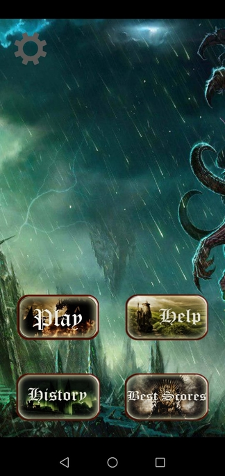
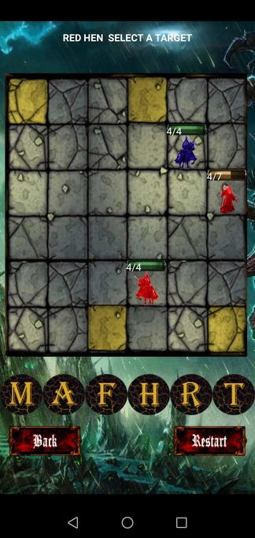

# NerdChess
An Android chess-like app, developed as a University project as a two-persons effort in collaboration with https://github.com/florin7 (November 2016 - January 2017).

The gameplay is reminiscent of chess, although some different rules are applied. Please consult the file https://github.com/robywan27/nerdchess/blob/master/NerdChess_GamePlay.pdf for understanding the rules of this game.

Disclaimer: if you examine the code, you will note how convoluted it is, with huge classes, long and nested if-else blocks, etc. If we were to re-implement the app from scratch, we would certainly follow a more principled methodology!

In addition to the basic functionality of the app, two points have been partially developed to further enrich the game:
- An artificial intelligence to play against the computer. It is advisable to play only the easy AI level, because the hard AI level takes a fairly long time to make calculations.
- A server connection enhancement which allows two players to play at two remote locations with their own device. This functionality is probably not functioning at all now.

